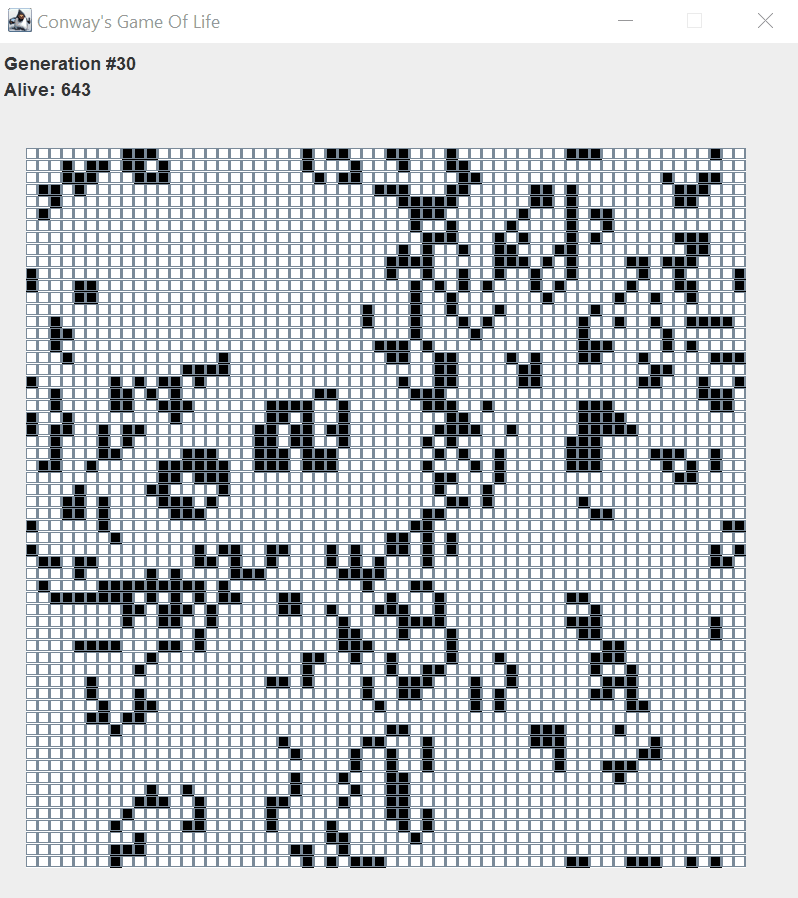
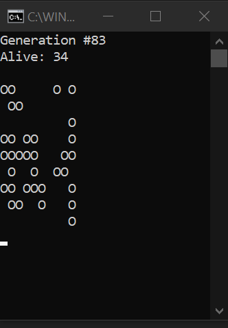

# Conway's Game Of Life
## [](https://github.com/kritika-srivastava/Random-Password-Generator/blob/master/LICENSE)[](https://www.repostatus.org/#active)
## 
The Game of Life is not your typical computer game. It is a 'cellular automaton', and was invented by Cambridge mathematician John Conway.

It consists of a collection of cells which, based on a few mathematical rules, can live, die or multiply. Depending on the initial conditions, the cells form various patterns throughout the course of the game.
&nbsp;


&nbsp;

## Dependencies
- Java
### Rules

The universe of the [Game Of Life ](https://en.wikipedia.org/wiki/Conway%27s_Game_of_Life) is an infinite two-dimensional matrix grid of square cells, each of which is in one of two possible states, alive or dead, or "populated" or "unpopulated". Every cell interacts with its eight neighbours, which are the cells that are horizontally, vertically, or diagonally adjacent. At each step in time, the following transitions occur:

* Any live cell with fewer than two live neighbours dies, as if caused by underpopulation.
* Any live cell with two or three live neighbours lives on to the next generation.
* Any live cell with more than three live neighbours dies, as if by overpopulation.
* Any dead cell with exactly three live neighbours becomes a live cell, as if by reproduction.

## Simulation
The simulation of this game can be done in two ways:
- Clone this Repository and run the class [Main.java](https://github.com/kritika-srivastava/Game-of-Life/blob/master/Main.java)
- Download the Jar File from [Releases Section](https://github.com/kritika-srivastava/Game-of-Life/releases/tag/1.0) of this Repository.
You have to enter the size of the population matrix followed by the delay duration in milli-seconds.

#### Running Jar File
To run jar file in the command Prompt change the directory to your current directory using the following command.
```
cd <Path to the directory containing jar file>
```
Then type the following command
```
java -jar Game.jar
```
### Output
There are two options for displaying the output.
- GUI output(As shown in GIF above)
- Console Output(Shown below)




